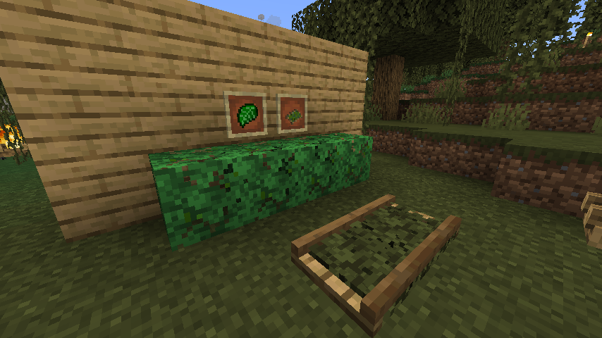

---
hide:
- navigation
- toc
---

<section class="mds-container">

 
 

 

 
<h1>SextiarySector4</h1> 

Minecraftに第六次産業の概念(?)を追加するMOD
 

<a href="download/" title="download" class="md-button md-button--primary"> ダウンロード </a>
<a href="catalog/" title="Material for MkDocs Insiders" class="md-button"> 要素一覧 </a>

 
 
 
 </section>
